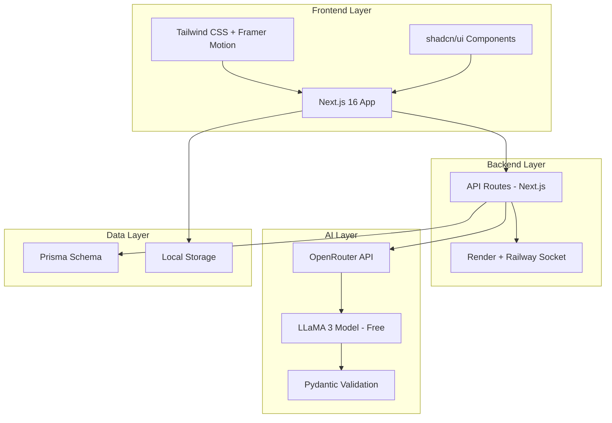
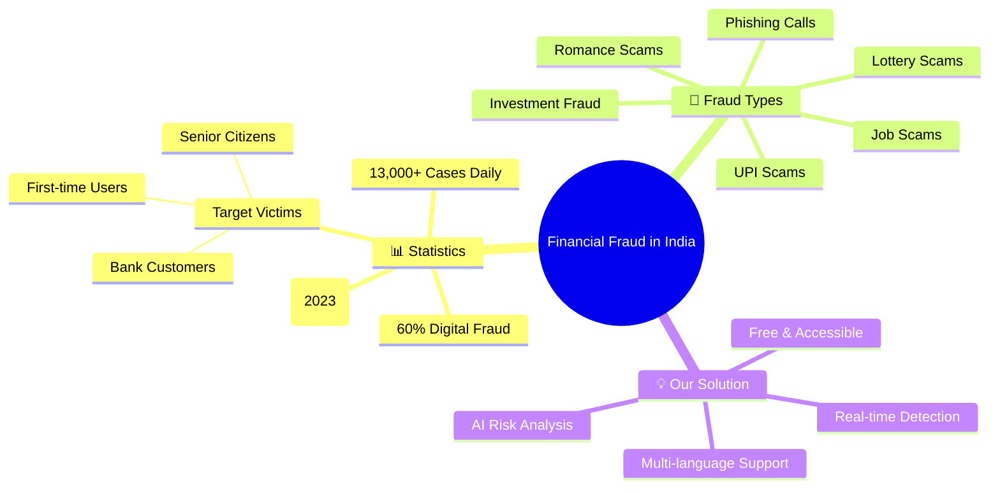
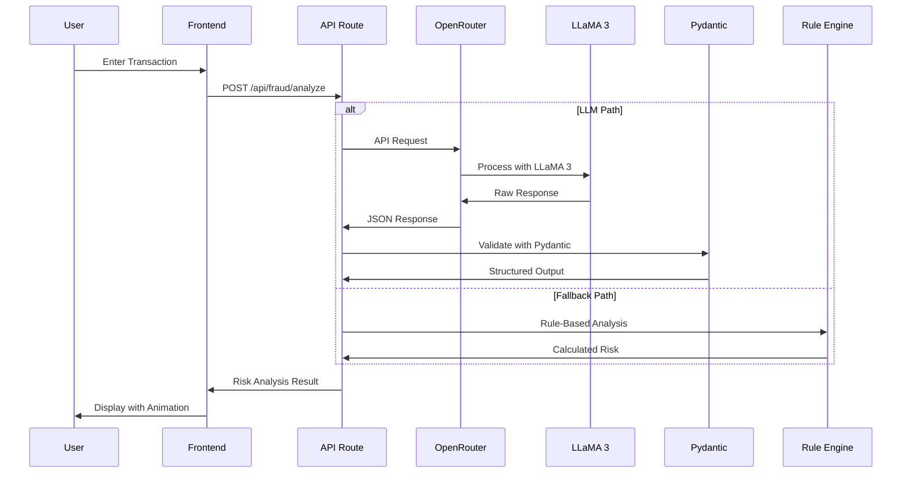
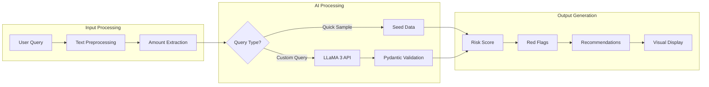
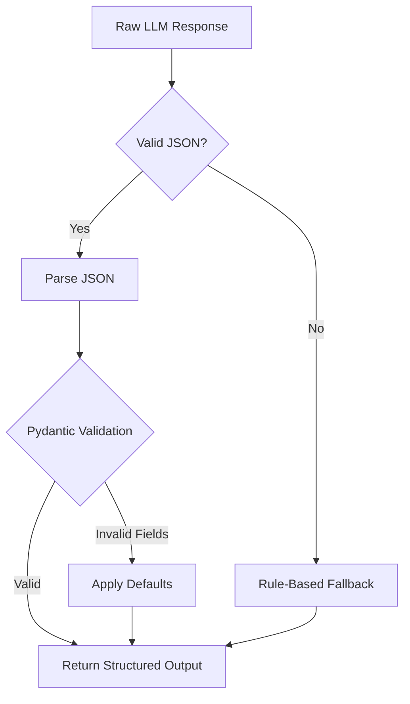
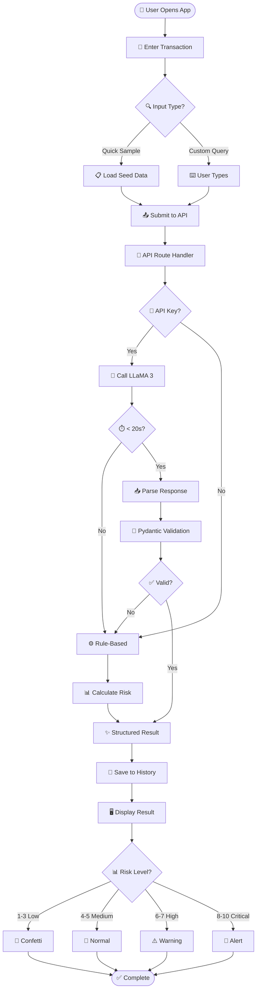
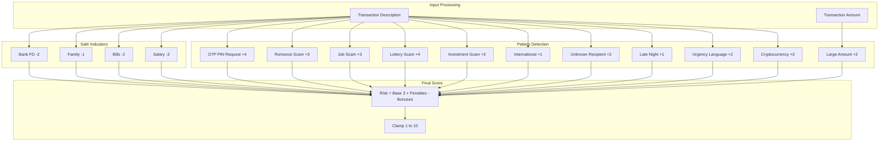
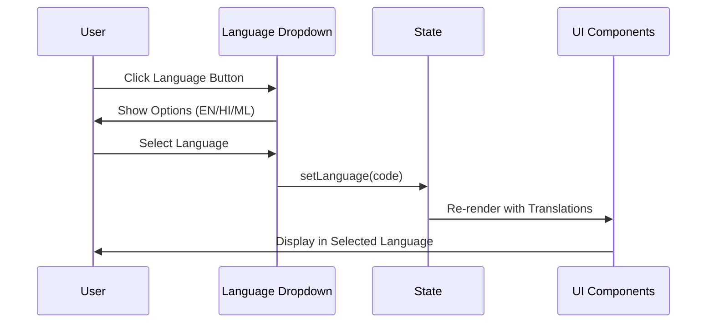

<div align="center">

# 🛡️ Financial Transaction Risk Agent

### *Multi Language AI-Powered Fraud Detection System for Indian Banks*


---


[](https://fraudprevent-agent-ansh.vercel.app/)
[](https://github.com/YOUR_USERNAME/fraud-risk-agent)
[](LICENSE)

---

### 🌐 **Live Demo:** [fraudprevent-agent-ansh.vercel.app](https://fraudprevent-agent-ansh.vercel.app/)

### 🎬 **Demo Video:** [https://drive.google.com/file/d/1wz_TTLqza12vKOxh4H_Y3jIPxdGZAPmy/view?usp=sharing](#) *(Click to Watch)*

---

## 📌 Project Overview - AI Agent Exercise

<div align="left">

###  Objective
Build an AI Agent that solves a **Real-World Problem** using OpenRouter API with structured output validation using **Pydantic models**.

### ✅ Requirements Fulfilled

| Requirement | Implementation | Status |
|-------------|----------------|:------:|
| 🔗 **OpenRouter API** | Integrated with LLaMA 3 (Free Model) | ✅ |
| 🐍 **Pydantic Validation** | Structured output validation | ✅ |
| 📝 **User Input Processing** | Transaction description + amount | ✅ |
| 🤖 **LLM Processing** | OpenRouter LLaMA 3 API | ✅ |
| 📊 **Actionable Output** | Risk score, recommendations, red flags | ✅ |
| 🌍 **Multi-language** | English, Hindi, Malayalam | ✅ |

###  Problem Solved
**Fraud Detection for Indian Banks** - A real-world problem affecting millions of users daily with financial losses due to various scam types.

</div>

</div>

---

## 🏗️ Technology Stack & Deployment

<div align="center">

### Deployment Architecture



### Tech Stack

| Layer | Technology | Purpose |
|-------|------------|---------|
|  **Frontend** | Next.js 16 + TypeScript | React App with App Router |
|  **UI/UX** | Tailwind CSS + Framer Motion | Styling & Animations |
|  **Components** | shadcn/ui | Pre-built UI library |
|  **LLM** | OpenRouter - LLaMA 3 (Free) | AI Processing |
|  **Validation** | Pydantic Models | Structured Output |
|  **Database** | Prisma Schema | Data Modeling |
|  **Backend** | Render + Railway Socket | Server & Real-time |
|  **Deployment** | Vercel | Frontend Hosting |

</div>

---

## 📑 Table of Contents

- [ Real-World Problem](#-real-world-problem)
- [ Features](#-features)
- [ AI Agent Architecture](#-ai-agent-architecture)
- [🐍 Pydantic Validation Models](#-pydantic-validation-models)
- [🔄 System Flow](#-system-flow)
- [📊 Risk Analysis Logic](#-risk-analysis-logic)
- [🌍 Multi-Language Support](#-multi-language-support)
- [Quick Start](#-quick-start)
- [🌐 Deployment Guide](#-deployment-guide)
- [📁 Project Structure](#-project-structure)
- [🔧 API Reference](#-api-reference)
- [⚡ Rate Limits & Usage](#-rate-limits--usage)
- [👨‍💻 Author](#-author)

---

##  Real-World Problem

<div align="center">

### Financial Fraud in India - A Critical Issue



</div>

### How This Agent Solves It

| Problem | Our Solution | Impact |
|---------|--------------|--------|
| 🔴 Users can't identify fraud | ✅ AI-powered risk analysis | Instant fraud detection |
| 🔴 Language barriers | ✅ Multi-language (EN/HI/ML) | Accessible to all Indians |
| 🔴 Complex banking jargon | ✅ Simple risk scores (1-10) | Easy to understand |
| 🔴 No guidance on action | ✅ Clear recommendations | Know what to do next |
| 🔴 Expensive solutions | ✅ Free tier deployment | Available to everyone |

---

## ✨ Features

<div align="center">

| Feature | Description | Status |
|---------|-------------|:------:|
| 🤖 **LLaMA 3 AI Analysis** | OpenRouter API with free model | ✅ |
| 🐍 **Pydantic Validation** | Structured output validation | ✅ |
| 📊 **Risk Score (1-10)** | Comprehensive risk assessment | ✅ |
| 🎨 **Animated UI** | Framer Motion animations | ✅ |
| 🌐 **Multi-language** | English, Hindi, Malayalam | ✅ |
| 🌙 **Dark/Light Mode** | Theme toggle support | ✅ |
| 💬 **AI Chatbot** | Fraud prevention assistant | ✅ |
| 📱 **Fully Responsive** | Mobile-first design | ✅ |
| 💾 **History Storage** | Local storage persistence | ✅ |
| ⚡ **Quick Samples** | Pre-loaded test data | ✅ |
| 🚨 **Visual Alerts** | Confetti & warning animations | ✅ |

</div>

---

## 🤖 AI Agent Architecture

<div align="center">

### How the AI Agent Works



</div>

### AI Agent Components



---

## 🐍 Pydantic Validation Models

<div align="center">

### Structured Output Validation

</div>

```python
from pydantic import BaseModel, Field
from typing import List, Literal

class TransactionAnalysis(BaseModel):
    """Pydantic model for structured transaction analysis output"""
    
    risk_score: int = Field(
        ..., 
        ge=1, 
        le=10, 
        description="Risk score from 1 (safe) to 10 (critical)"
    )
    
    is_suspicious: bool = Field(
        ..., 
        description="Whether the transaction is flagged as suspicious"
    )
    
    risk_level: Literal["Low", "Medium", "High", "Critical"] = Field(
        ..., 
        description="Categorized risk level"
    )
    
    recommended_action: str = Field(
        ..., 
        min_length=10, 
        description="Actionable recommendation for the user"
    )
    
    reasoning: str = Field(
        ..., 
        min_length=20, 
        description="Detailed explanation of the analysis"
    )
    
    red_flags: List[str] = Field(
        default_factory=list, 
        description="List of detected red flags"
    )
    
    confidence: float = Field(
        ..., 
        ge=0.0, 
        le=1.0, 
        description="Confidence score of the analysis"
    )


class ChatResponse(BaseModel):
    """Pydantic model for chat response validation"""
    
    response: str = Field(
        ..., 
        min_length=10, 
        description="Chatbot response text"
    )
    
    success: bool = Field(
        default=True, 
        description="Whether the request was successful"
    )
```

### Validation Flow



---

## 🔄 System Flow

### Complete Transaction Analysis Flow



---

## 📊 Risk Analysis Logic

### Risk Scoring Algorithm



### Risk Level Breakdown

<div align="center">

| Score | Level | Color | Action | Description |
|:-----:|:-----:|:-----:|--------|-------------|
| **1-3** | 🟢 **LOW** | `#10B981` | ✅ Approve | Safe - salary, bills, known payees |
| **4-5** | 🟡 **MEDIUM** | `#F59E0B` | ⚠️ Monitor | Unusual but explainable |
| **6-7** | 🟠 **HIGH** | `#F97316` | 🔶 Verify | Multiple red flags detected |
| **8-10** | 🔴 **CRITICAL** | `#EF4444` | 🚫 Block | Strong fraud indicators |

</div>

---

## 🌍 Multi-Language Support

<div align="center">

### Supported Languages

| Language | Code | Flag | Native Name | Status |
|----------|:----:|:----:|-------------|:------:|
| English | `en` | 🇬🇧 | English | ✅ |
| Hindi | `hi` | 🇮🇳 | हिंदी | ✅ |
| Malayalam | `ml` | 🇮🇳 | മലയാളം | ✅ |

### Language Selection Flow



</div>

---

## 🚀 Quick Start

### Prerequisites

<div align="center">

[](https://nodejs.org/)
[](https://openrouter.ai/)

</div>

### Installation

```bash
# 1️⃣ Clone the repository
git clone https://github.com/YOUR_USERNAME/fraud-risk-agent.git
cd fraud-risk-agent

# 2️⃣ Install dependencies
npm install

# 3️⃣ Create environment file
echo "OPENROUTER_API_KEY=your_key_here" > .env.local

# 4️⃣ Run development server
npm run dev

# 5️⃣ Open http://localhost:3000
```

---

## 🌐 Deployment Guide

### Current Deployment

<div align="center">

| Component | Platform | URL |
|-----------|----------|-----|
| 🎨 Frontend | Vercel | [fraudprevent-agent-ansh.vercel.app](https://fraudprevent-agent-ansh.vercel.app/) |
| 🤖 LLM | OpenRouter | LLaMA 3 (Free Tier) |
| 🗄️ Database | Prisma | Schema-based |
| 🔌 Backend | Render + Railway | Socket connections |

</div>

### Deploy Your Own


<details>
<summary>🔧 Step-by-Step Deployment</summary>

1. **Push to GitHub**
   ```bash
   git init && git add . && git commit -m "Initial commit"
   git remote add origin https://github.com/YOUR_USERNAME/fraud-risk-agent.git
   git push -u origin main
   ```

2. **Import to Vercel**
   - Go to [vercel.com/new](https://vercel.com/new)
   - Import your GitHub repository

3. **Add Environment Variable**
   - Settings → Environment Variables
   - Name: `OPENROUTER_API_KEY`
   - Value: Your OpenRouter API key

4. **Deploy & Test**
   - Click Deploy
   - Test the live application

</details>

---

## 📁 Project Structure

```
📦 fraud-risk-agent/
├── 📁 public/
│   └── 🖼️ logo.svg
│
├── 📁 src/
│   ├── 📁 app/
│   │   ├── 📁 api/fraud/
│   │   │   ├── 📁 analyze/route.ts    # Analysis API
│   │   │   └── 📁 chat/route.ts       # Chat API
│   │   ├── 📄 page.tsx                # Main UI
│   │   ├── 📄 layout.tsx              # Root Layout
│   │   └── 📄 globals.css             # Styles
│   │
│   ├── 📁 components/
│   │   ├── 📁 theme/                  # Theme Provider
│   │   └── 📁 ui/                     # shadcn/ui
│   │
│   └── 📁 lib/
│       └── 📄 utils.ts
│
├── 📁 prisma/
│   └── 📄 schema.prisma               # Database Schema
│
├── 📄 package.json
├── 📄 tailwind.config.ts
├── 📄 next.config.ts
└── 📄 README.md
```

---

## 🔧 API Reference

### Analyze Transaction

**POST** `/api/fraud/analyze`

**Request:**
```json
{
  "description": "Transfer ₹50,000 to unknown beneficiary at 2 AM",
  "amount": 50000
}
```

**Response:**
```json
{
  "success": true,
  "data": {
    "risk_score": 8,
    "is_suspicious": true,
    "risk_level": "High",
    "recommended_action": "Hold transaction. Verify with customer.",
    "reasoning": "Multiple red flags detected...",
    "red_flags": ["Late night timing", "Unknown recipient"],
    "confidence": 0.88
  },
  "method": "llm"
}
```

### Chat Assistant

**POST** `/api/fraud/chat`

**Request:**
```json
{
  "message": "What is a risk score?"
}
```

**Response:**
```json
{
  "success": true,
  "response": "📊 Risk Score Guide...",
  "method": "llm"
}
```

---

## ⚡ Rate Limits & Usage

<div align="center">

### ⚠️ Important Notice

```
╔═══════════════════════════════════════════════════════════╗
║  🔔 PLEASE READ - Rate Limits Apply                        ║
║                                                             ║
║  • OpenRouter free tier has rate limits                     ║
║  • DO NOT click Analyze repeatedly                          ║
║  • Use Quick Samples for instant results (no API call)      ║
║  • Custom queries go to LLaMA 3 API                         ║
║  • Save tokens for actual use cases                         ║
║                                                             ║
║  💡 Best viewed on Laptop/Desktop                           ║
╚═══════════════════════════════════════════════════════════╝
```

### Usage Tips

| Action | API Call? | Speed | Recommendation |
|--------|:---------:|:-----:|----------------|
| Quick Samples | ❌ No | Instant | ✅ Use for demo |
| Custom Query | ✅ Yes | 5-15s | Use wisely |
| Chat Bot | ✅ Yes | 5-10s | Limit usage |

</div>

---

## 🎬 Demo & Screenshots

<div align="center">

### Feature Highlights

| Feature | Preview |
|---------|---------|
| 🔍 **Risk Analysis** | Analyzes transactions with AI |
| 📊 **Risk Meter** | Visual score from 1-10 |
| 🎨 **Animated UI** | Framer Motion effects |
| 🌙 **Dark Mode** | Theme switching |
| 🌐 **Multi-language** | EN/HI/ML support |
| 💬 **Chat Bot** | Fraud prevention assistant |

### Quick Sample Features

| Sample | Description | Risk |
|--------|-------------|------|
| 🚨 Crypto Transfer | ₹4.5L at 3:30 AM to wallet | Critical |
| ✅ Salary Credit | Monthly salary from employer | Low |
| ⚠️ International Wire | Urgent transfer to Nigeria | Critical |
| 💡 Bill Payment | Electricity bill via UPI | Low |
| ⚡ Rapid Transfers | ₹10K x 15 in 30 mins | High |
| 🏦 FD Maturity | Fixed deposit credit | Low |

</div>

---

## 👨‍💻 Author

<div align="center">

### **Ansh Sharma**

---

🎓 **BTech Student** @ **NIT Calicut**  
🏛️ National Institute of Technology Calicut  
💻 Computer Science & Engineering

---

[](https://www.linkedin.com/in/anshsharmacse/)
[](https://github.com/YOUR_USERNAME)

---

**Project Completion Date:** March 24, 2026

**Status:** ✅ Deployed + OpenRouter LLM - LLaMA 3 + Pydantic Validation

</div>

---

## 🙏 Acknowledgments

<div align="center">

| Resource | Purpose |
|----------|---------|
| [OpenRouter](https://openrouter.ai/) | LLaMA 3 Free API |
| [Next.js](https://nextjs.org/) | React Framework |
| [shadcn/ui](https://ui.shadcn.com/) | UI Components |
| [Framer Motion](https://www.framer.com/motion/) | Animations |
| [Vercel](https://vercel.com/) | Deployment |
| [Tailwind CSS](https://tailwindcss.com/) | Styling |

</div>

---

## 📄 License

<div align="center">

[](https://opensource.org/licenses/MIT)

**MIT License** - Free to use, modify, and distribute.

</div>

---

<div align="center">

### ⭐ If you found this project helpful, please give it a star!

**Made with ❤️ in India 🇮🇳**

**🏆 AI Agent Exercise - Successfully Completed**

</div>
